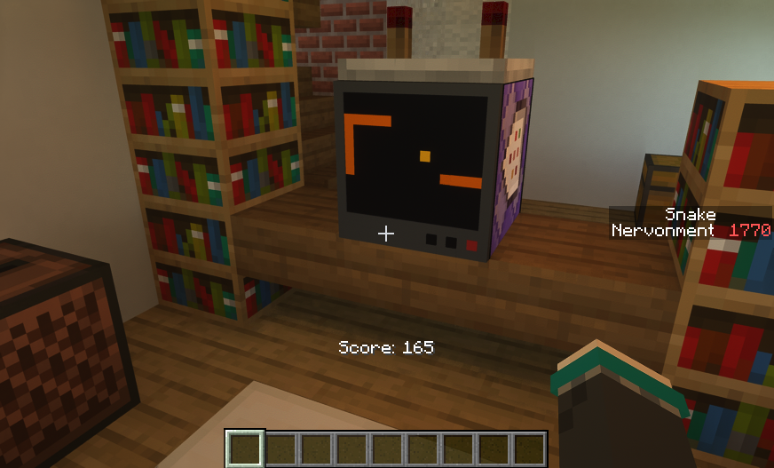

# MCScript

[简体中文](README_zh-CN.md) | **English**

MCScript is a simple programming language. Its target language is Minecraft Command (`.mcfunction`). Through MCScript, you can easily port logic written in other high-level programming languages to Minecraft datapacks. 

*MCScript is not suitable for developing large projects, but it is very useful for rapidly writing small auxiliary tools.*

## Examples

- The MCScript code below generates a 10-block-high column of alternating yellow and black concrete above your head. 

```
fn generate_column() {
    let y = 2;
    while y < 12 {
        if y % 2 {
            run_command!("setblock ~ ~{} ~ yellow_concrete", y);
        } else {
            run_command!("setblock ~ ~{} ~ black_concrete", y);
        }
        y += 1;
    }
}
```


- The code in [example/maze.mcs](example/maze.mcs) generates a 45×45 maze.


- The code in [example/snake.mcs](example/snake.mcs) generates a screen that can play the Snake game:



## Usage

For more details, see [here](usage.md). 

MCScript supports exporting datapacks for Minecraft Java Edition 1.21 (with datapack version 48). The following command specifies the input file as `my_datapack.mcs`, and exports a datapack named `my_datapack` (containing the functions in the input file).

```sh
mcsc my_datapack.mcs -o my_datapack
```

Multiple input files can be specified:

```sh
mcsc namespace_1.mcs namespace_2.mcs -o my_datapack
```

Additionally, the compiler outputs a datapack named `mcscript` which contains some common functions.

After copying the two datapacks to `.minecraft/saves/<save name>/datapacks/`, enter the game. The first time you use the datapack generated by mcscript, you need to run the command `/function mcscript:init` to initialize it. To call the function named `func` in `file_name.mcs` in the game, enter the following command:

```
/function file_name:func
```

## Quick Start

See [Here](MCScript.md). 

## Running Tests

See [Here](test.md). 

## Plan

- Objects & tuples. 
- Methods for getting data from entities and block entities.
- IR design & optimization. 
- Compile-time constants. 
- References. 