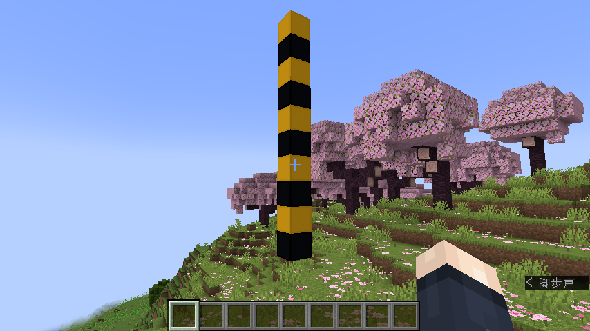

# MCScript

MCScript 是一门简易的编程语言, 它的目标语言为 Minecraft 命令 (`.mcfunction`). MCScript 的目标是让 Minecraft 命令的编写变得更加方便. 

*目前使用 MCScript 编译器生成的数据包性能可能不如手工编写, 不建议将其用于生产用途.*

## 示例

下面的 MCScript 代码的功能是在自己头顶向上生成一个10格高, 黄色和黑色混凝土交替的柱子: 
```
fn generate_column() {
    let y = 2;
    while y < 12 {
        if y % 2 {
            run_command!("setblock ~ ~{} ~ yellow_concrete", y);
        } else {
            run_command!("setblock ~ ~{} ~ black_concrete", y);
        }
        y += 1;
    }
}
```



## 使用编译器
MCScript 支持输出 Minecraft Java 版 1.21 版本的数据包 (数据包版本 48). 以下命令指定了输入文件为 `my_datapack.mcs`, 输出名为 `my_datapack` 的数据包 (包含输入文件中的函数). 

```sh
mcscript my_datapack.mcs -o my_datapack
```

可以指定多个输入文件: 


```sh
mcscript namespace_1.mcs namespace_2.mcs -o my_datapack
```

此外, 编译器还会输出名为 `mcscript` 的数据包, 其中包含一些通用函数. 

将两个数据包复制到 `.minecraft/saves/<存档名字>/datapacks/` 后, 进入游戏. 首次使用 mcscript 生成的数据包, 需要运行命令 `/function mcscript:init` 进行初始化. 要在游戏中调用 `file_name.mcs` 中名为 `func` 的函数, 输入以下命令即可: 

```
/function file_name:func
```

## 快速入门

参见[此处](MCScript.md). 

## 运行测试

参见[此处](test.md). 
